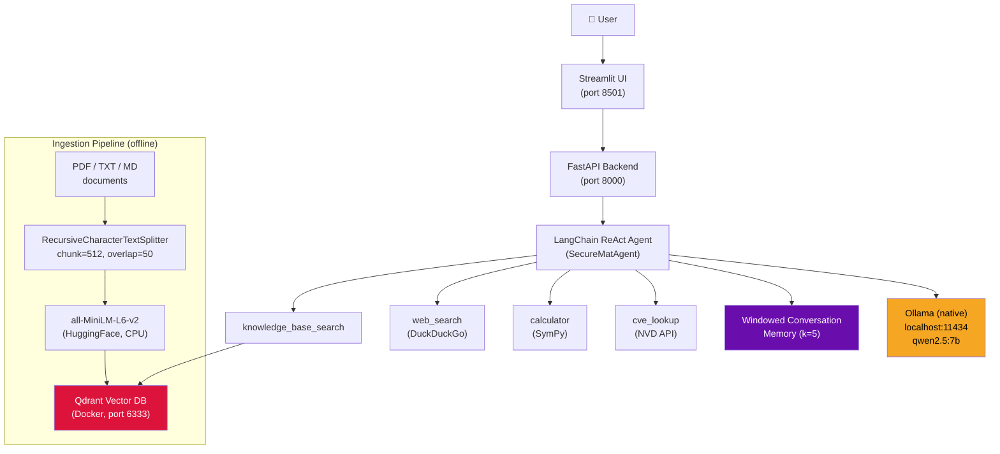

# SecureMatAgent


## What is this?

**SecureMatAgent** is a fully local, agentic Retrieval-Augmented Generation (RAG) system that serves as a cybersecurity-aware scientific research intelligence assistant. It combines a LangChain ReAct agent powered by Qwen2.5 7B (running natively via Ollama) with semantic search over a curated corpus of materials-science papers and cybersecurity standards. Because every component runs on-premises — no OpenAI API, no cloud LLM calls — sensitive research data never leaves your machine.

---

## Architecture



---

## Key Features

- **100% local execution** — Qwen2.5 7B via Ollama, Qdrant vector store, HuggingFace embeddings; zero external LLM API calls.
- **ReAct agentic loop** — the agent reasons step-by-step, selects tools, observes results, and iterates up to 8 times before producing a final answer.
- **Four specialist tools** — semantic knowledge-base search, live DuckDuckGo web search, SymPy symbolic calculator, and NIST NVD CVE lookup (no API key).
- **Dual-domain corpus** — 26 documents spanning perovskite/battery/XRD materials science (arXiv) and NIST cybersecurity standards (SP 800-53r5, SP 800-171r3, CSF v2).
- **Windowed conversation memory** — keeps the last 5 turns so the agent can handle follow-up questions coherently.
- **Configurable via `.env`** — swap models, tune chunk sizes, change collection names, or flip `LOCAL_DEV=true` without touching code.
- **Streamlit chat UI** — clean, stateful chat interface that streams responses from the FastAPI backend.
- **Production-ready containerisation** — non-root Docker image, health-checked Qdrant service, structured logging via Loguru.

---

## Tech Stack

| Component | Technology | Purpose |
|---|---|---|
| LLM | Qwen2.5 7B via Ollama | ReAct reasoning and tool orchestration |
| Agent framework | LangChain (ReAct) | Tool routing, memory, prompt templating |
| Vector store | Qdrant (Docker) | Storing and querying embedded document chunks |
| Embeddings | `all-MiniLM-L6-v2` (HuggingFace) | 384-dim dense embeddings, CPU inference |
| Web framework | FastAPI + Uvicorn | REST API: `/chat`, `/ingest`, `/health`, `/ready` |
| UI | Streamlit | Browser-based chat interface |
| CVE lookup | NIST NVD REST API v2 | Live vulnerability data, no key required |
| Web search | DuckDuckGo Search | Keyless live web search for the agent |
| Math | SymPy | Safe symbolic and numeric expression evaluation |
| Configuration | Pydantic Settings | Typed env-var config with `LOCAL_DEV` auto-patch |
| Containerisation | Docker Compose (2 services) | `app` + `qdrant`; Ollama runs natively on host |

---

## Quick Start

### Prerequisites

- Python 3.10+
- [Ollama](https://ollama.com/) installed natively on your host
- Docker Desktop (for Qdrant)

### 1. Clone the repository

```bash
git clone https://github.com/abhishek-daundkar/SecureMatAgent.git
cd SecureMatAgent
```

### 2. Install Ollama and pull the model

```bash
# Install Ollama from https://ollama.com/ then:
ollama pull qwen2.5:7b
```

### 3. Start Qdrant (Docker only — Ollama runs natively)

```bash
docker compose up -d qdrant
```

> The `docker-compose.yml` has two services: `qdrant` and `app`. For local development, run just `qdrant` in Docker and the app directly on your host.

### 4. Create and activate the virtual environment

```powershell
# Windows (PowerShell)
python -m venv .venv
.venv\Scripts\Activate.ps1
```

```bash
# macOS / Linux
python -m venv .venv
source .venv/bin/activate
```

### 5. Install dependencies

```bash
pip install -r requirements.txt
```

### 6. Configure environment

```bash
cp .env.example .env
# .env already has LOCAL_DEV=true for host-side development
# Edit OLLAMA_MODEL, collection name, etc. as needed
```

### 7. Ingest the document corpus

```bash
# Collect documents (arXiv, NIST, SDS, synthetic lab docs)
python scripts/collect_corpus.py --output-dir ./data/documents

# Ingest into Qdrant
python app/ingestion/ingest.py --data-dir ./data/documents
```

### 8. Start the application

```bash
# Option A: Streamlit UI only (connects to FastAPI automatically)
streamlit run ui/streamlit_app.py

# Option B: FastAPI backend only
uvicorn app.main:app --reload --host 0.0.0.0 --port 8000

# Option C: Full Docker stack (app + qdrant, Ollama remains native)
docker compose up -d
```

Open **http://localhost:8501** for the chat UI, or **http://localhost:8000/docs** for the API explorer.

---

## Example Queries

| Query | Expected Behaviour |
|---|---|
| `"What is the bandgap of CH3NH3PbI3 perovskite?"` | Retrieves from arXiv perovskite papers; cites source chunks |
| `"Look up CVE-2024-3094"` | Calls `cve_lookup` → returns NVD severity, description, CVSS score |
| `"What does NIST SP 800-53r5 say about access control?"` | Searches knowledge base for AC family controls |
| `"Calculate the molar mass of LiCoO2"` | Uses `calculator` with SymPy to compute `6.941 + 58.933 + 2*15.999` |
| `"Are there recent vulnerabilities in OpenSSL?"` | Falls back to `web_search` if not in KB; returns live DuckDuckGo results |
| `"Summarise the XRD characterisation methods from the ingested papers"` | Multi-step KB search; synthesises across multiple chunks |

---

## Project Structure

```
D:\Project_RAG\
├── app/
│   ├── main.py                  # FastAPI app entry point, lifespan hooks
│   ├── agent/
│   │   ├── rag_agent.py         # SecureMatAgent class, ReAct AgentExecutor
│   │   └── tools.py             # 4 tools: knowledge_base_search, web_search,
│   │                            #          calculator, cve_lookup
│   ├── api/
│   │   └── routes.py            # REST routes: /health /ready /chat /ingest DELETE/memory
│   └── ingestion/
│       └── ingest.py            # PDF+TXT loader → text splitter → Qdrant upsert
├── config/
│   └── settings.py              # Pydantic BaseSettings; LOCAL_DEV auto-patch
├── ui/
│   └── streamlit_app.py         # Streamlit chat UI (connects to FastAPI)
├── scripts/
│   ├── collect_corpus.py        # Corpus collection orchestrator
│   ├── validate_corpus.py       # Corpus integrity checker
│   ├── check_services.py        # Health check: Ollama + Qdrant
│   ├── entrypoint.sh            # Docker entrypoint: uvicorn + streamlit
│   └── collectors/
│       ├── arxiv_collector.py   # 14 arXiv PDFs (materials science)
│       ├── nist_collector.py    # 4 NIST PDFs (cybersecurity standards)
│       ├── msds_collector.py    # 5 SDS TXT files via PubChem
│       └── custom_docs.py       # 3 synthetic lab Markdown docs
├── tests/
│   ├── test_settings.py
│   └── test_tools.py
├── data/
│   └── documents/               # Ingested corpus (26 docs, ~44 MB)
├── docker-compose.yml           # 2 services: app + qdrant
├── Dockerfile                   # python:3.10-slim, non-root appuser
├── requirements.txt
├── .env.example                 # Template — copy to .env
├── Makefile                     # build / up / down / ingest / test / check
├── .gitignore
└── .dockerignore
```

---

## Architecture Deep Dive

### ReAct Loop

SecureMatAgent uses LangChain's `create_react_agent` to implement the Reasoning + Acting pattern. On each user query the agent:

1. **Thinks** — decides which tool (if any) to invoke.
2. **Acts** — calls one tool with structured input.
3. **Observes** — receives the tool output.
4. **Iterates** — repeats up to `max_iterations=8` until it can produce a `Final Answer`.

The agent prompt enforces a strict `Thought / Action / Action Input / Observation` format which Qwen2.5 7B follows reliably (Mistral 7B was evaluated and rejected because it failed to call tools consistently).

### Tool Selection Strategy

The system prompt instructs the agent to:
- **Always search the knowledge base first** (`knowledge_base_search`) before reaching for the web.
- Fall back to `web_search` (DuckDuckGo, keyless) only when the KB returns no relevant results.
- Use `cve_lookup` whenever a CVE ID is mentioned or a vulnerability is discussed.
- Invoke `calculator` to verify any mathematical claim rather than hallucinating a result.

### Memory

`ConversationBufferWindowMemory` with `k=5` keeps the last 5 conversation turns in the prompt. This allows coherent multi-turn dialogue ("what about its thermal conductivity?" following a prior material query) without unbounded context growth.

### Retrieval Pipeline

Documents are split with `RecursiveCharacterTextSplitter` (chunk size 512 tokens, overlap 50). Each chunk is embedded with `all-MiniLM-L6-v2` (384 dimensions, L2-normalised) and stored in Qdrant. At query time, the same embedding model converts the query to a vector and Qdrant returns the top-`k` (default 5) most similar chunks by cosine similarity.

---

## Configuration

All settings are controlled via environment variables (or `.env`). Copy `.env.example` to `.env` to get started.

| Variable | Default | Description |
|---|---|---|
| `LOCAL_DEV` | `false` | Set `true` to auto-patch URLs for host-side dev (no Docker for the app) |
| `OLLAMA_BASE_URL` | `http://host.docker.internal:11434` | Ollama endpoint (auto-patched to `localhost` when `LOCAL_DEV=true`) |
| `OLLAMA_MODEL` | `qwen2.5:7b` | Ollama model name — must support tool calling |
| `OLLAMA_TEMPERATURE` | `0.1` | LLM sampling temperature |
| `OLLAMA_TIMEOUT` | `120` | Seconds before an LLM request times out |
| `QDRANT_HOST` | `qdrant` | Qdrant hostname (auto-patched to `localhost` when `LOCAL_DEV=true`) |
| `QDRANT_PORT` | `6333` | Qdrant HTTP port |
| `COLLECTION_NAME` | `securematagent_docs` | Qdrant collection name |
| `EMBEDDING_MODEL` | `sentence-transformers/all-MiniLM-L6-v2` | HuggingFace embedding model |
| `EMBEDDING_DEVICE` | `cpu` | `cpu` or `cuda` |
| `CHUNK_SIZE` | `512` | Tokens per document chunk |
| `CHUNK_OVERLAP` | `50` | Overlap tokens between consecutive chunks |
| `TOP_K` | `5` | Retrieved chunks per knowledge-base query |
| `MEMORY_WINDOW` | `5` | Conversation turns retained in agent memory |
| `API_HOST` | `0.0.0.0` | FastAPI bind address |
| `API_PORT` | `8000` | FastAPI port |
| `DATA_DIR` | `data/documents` | Source document directory for ingestion |

---

## Evaluation

SecureMatAgent ships a full offline evaluation pipeline using [RAGAS](https://docs.ragas.io/) backed by local Ollama/Mistral — no OpenAI API required.

### Test Set

30 questions spanning three domains with varying difficulty:

| Domain | Questions | Types |
|--------|-----------|-------|
| Materials Science | 15 | Factual retrieval, calculator, multi-doc synthesis, range queries, anomaly detection |
| Cybersecurity | 10 | NIST policy lookup, access controls, incident response, lab security |
| Cross-domain | 5 | Bridging materials + cybersecurity |
| — Negative cases | 4 | Questions the system should correctly decline |

### Metrics

| Metric | Description | How measured |
|--------|-------------|--------------|
| **Faithfulness** | Claims grounded in retrieved context | RAGAS (Mistral judge) |
| **Answer Relevancy** | Answer addresses the question | RAGAS (Mistral judge) |
| **Context Precision** | Retrieved chunks are on-topic | RAGAS (Mistral judge) |
| **Context Recall** | Correct chunks retrieved | RAGAS (Mistral judge) |
| **Keyword Overlap (F1)** | Token overlap vs ground truth | Offline fallback |
| **Tool Accuracy** | Correct tool selected for each query | Exact match vs test set |

### Running the Evaluation

```bash
# Install evaluation dependencies (one-time)
pip install -r eval/requirements-eval.txt

# Full evaluation — 30 questions, RAGAS + tool accuracy + charts
make eval

# Quick evaluation — 10 questions, custom metrics only (~5× faster, no LLM judge)
make eval-quick

# Regenerate charts from existing JSON results
make eval-charts

# CLI with options
python eval/run_eval.py --test-set eval/test_set.json --output eval/results/ --visualize
python eval/run_eval.py --quick --no-ragas   # fastest, no Ollama required
python eval/run_eval.py --ids MS-001 CY-003  # specific questions only
```

Results are saved to `eval/results/`:

```
eval/results/
├── ragas_scores.json       # RAGAS + custom metric scores per question
├── tool_accuracy.json      # Tool selection accuracy + confusion matrix
├── summary.md              # Human-readable report with recommendations
└── charts/
    ├── ragas_by_domain.png             # Bar chart: metrics by domain
    ├── tool_confusion_matrix.png       # Heatmap: expected vs actual tool
    └── faithfulness_vs_relevancy.png   # Scatter: faithfulness vs relevancy
```

### Scores _(run `make eval` to populate)_

| Metric | Score |
|--------|-------|
| Faithfulness | — |
| Answer Relevancy | — |
| Context Precision | — |
| Context Recall | — |
| Tool Selection Accuracy | — |

See [`eval/results/summary.md`](eval/results/summary.md) for the full report.

---

## Makefile Targets

```bash
make build       # Build Docker images
make up          # Check Ollama, then docker compose up -d
make down        # docker compose down
make logs        # Follow container logs
make ingest      # Run ingestion script inside the venv
make test        # Run pytest inside the venv
make check       # Run scripts/check_services.py
make shell       # Open shell in the app container
make clean       # Remove containers, volumes, and __pycache__
make eval        # Full RAGAS + tool accuracy evaluation (30 questions)
make eval-quick  # Quick evaluation — 10 questions, no RAGAS (~5× faster)
make eval-charts # Regenerate charts from existing eval/results/ JSON files
```

---

## License

MIT — see [LICENSE](LICENSE).

---

## Author

**Abhishek Daundkar**
