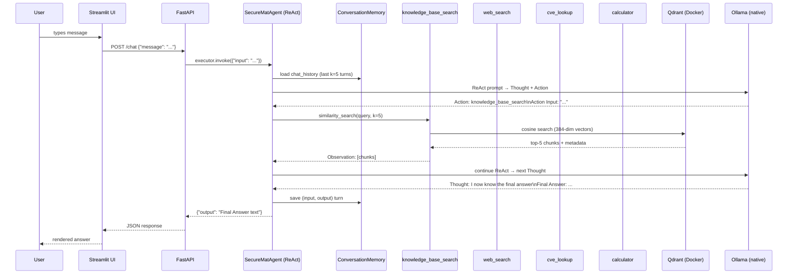
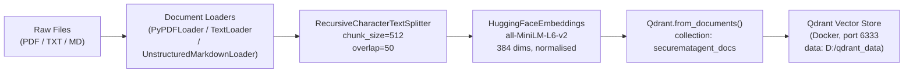

# SecureMatAgent — Architecture Deep Dive

This document describes the internal design of SecureMatAgent: data flow, component choices, and the engineering decisions behind each layer.

---

## Table of Contents

1. [System Overview](#system-overview)
2. [Detailed Data Flow](#detailed-data-flow)
3. [Ingestion Pipeline](#ingestion-pipeline)
4. [Chunking Strategy](#chunking-strategy)
5. [Embedding Model Choice](#embedding-model-choice)
6. [Agent Design and Prompt Engineering](#agent-design-and-prompt-engineering)
7. [Tool Architecture](#tool-architecture)
8. [Memory Management](#memory-management)
9. [Service Topology](#service-topology)
10. [Security Design](#security-design)

---

## System Overview

SecureMatAgent is an **agentic RAG** system. Unlike naive RAG (retrieve → answer), the agent loop allows the model to:

- Decide *whether* retrieval is needed at all.
- Choose *which* tool is most appropriate (KB search, web, calculator, CVE lookup).
- Chain multiple tool calls when a query requires multi-step reasoning.
- Integrate retrieved evidence before synthesising a grounded answer.

The underlying LLM is **Qwen2.5 7B** running through **Ollama** natively on the host machine. No cloud API calls are made at any point.

---

## Detailed Data Flow



---

## Ingestion Pipeline



### Corpus composition

| Source | Collector | Count | Domain |
|---|---|---|---|
| arXiv | `arxiv_collector.py` | 14 PDFs | Materials science (perovskite, battery, XRD, ceramics) |
| NIST | `nist_collector.py` | 4 PDFs | Cybersecurity (800-53r5, 800-171r3, CSF v2, 800-88r1) |
| PubChem SDS | `msds_collector.py` | 5 TXT files | Safety data sheets for lab chemicals |
| Synthetic | `custom_docs.py` | 3 MD files | Synthetic lab procedure documents |
| **Total** | | **26 docs / ~44 MB** | |

All arXiv papers are CC-licensed; NIST documents are US Government public domain; SDS files are OSHA-required open disclosures.

---

## Chunking Strategy

**Choice:** `RecursiveCharacterTextSplitter` with `chunk_size=512`, `chunk_overlap=50`.

**Rationale:**

- **512 tokens** fits comfortably within the `all-MiniLM-L6-v2` max sequence length (256 word-pieces). Chunks are short enough for the embedding model to produce high-quality, focused vectors, yet long enough to contain a complete scientific claim or control statement.
- **50-token overlap** prevents boundary effects where a sentence is cut across two chunks and neither chunk carries the full meaning. For regulatory documents (NIST), control descriptions often span 3–5 sentences; overlap ensures they are not silently split.
- `RecursiveCharacterTextSplitter` tries paragraph → sentence → word boundaries in order, preserving natural language structure better than a naive fixed-width split.
- Scientific PDFs extracted via `pypdf` contain noisy whitespace; the recursive splitter's multi-level separators (`["\n\n", "\n", " ", ""]`) handle this gracefully.

**Known edge case:** NIST SP 800-53r5 is 492 pages with deeply nested cross-references that cause `pypdf` to hit a recursion limit on the outline. The ingestor falls back to full-document text extraction in this case — the document is still fully ingested, just without per-section metadata.

---

## Embedding Model Choice

**Model:** `sentence-transformers/all-MiniLM-L6-v2`

| Property | Value |
|---|---|
| Architecture | MiniLM-L6 distilled from BERT-base |
| Output dimensions | 384 |
| Max input tokens | 256 word-pieces |
| Hardware | CPU (default); set `EMBEDDING_DEVICE=cuda` for GPU |
| Licence | Apache 2.0 |

**Rationale:**

1. **Speed on CPU** — At 384 dimensions and 6 transformer layers, MiniLM-L6 is 5× faster than `all-mpnet-base-v2` on CPU. This matters for ingesting 26 documents on a developer machine without a GPU.
2. **Cosine similarity quality** — The model is trained with a cosine similarity objective and produces normalised vectors (`normalize_embeddings=True`), making Qdrant's dot-product retrieval equivalent to cosine distance.
3. **Domain adequacy** — MTEB benchmarks show all-MiniLM-L6-v2 performs competitively on both scientific and technical English text. For a research prototype targeting English-language arXiv papers and NIST standards, this is sufficient.
4. **Zero external calls** — The model weights are downloaded once from HuggingFace Hub at first run and cached locally. All subsequent inference is fully offline.

---

## Agent Design and Prompt Engineering

### ReAct framework

The agent uses LangChain's `create_react_agent` with the standard ReAct format:

```
Thought: <reasoning step>
Action: <tool name>
Action Input: <tool input>
Observation: <tool output>
... (repeats)
Thought: I now know the final answer
Final Answer: <answer>
```

`AgentExecutor` is configured with:
- `max_iterations=8` — prevents runaway loops on unanswerable questions.
- `handle_parsing_errors=True` — if the LLM produces a malformed action line, the executor injects an error observation and asks the model to retry rather than crashing.
- `early_stopping_method="generate"` — when the iteration limit is reached, the model generates a best-effort final answer from its current scratchpad rather than returning a silent failure.

### Prompt design decisions

1. **"Always search the knowledge base first"** — Without this explicit instruction, models often go straight to web search even when the answer is in the corpus. This rule reduces unnecessary web calls and keeps answers grounded in curated sources.

2. **"Cite CVE IDs when available"** — Encourages the model to use the `cve_lookup` tool rather than hallucinating CVE numbers from training data.

3. **"Use the calculator to verify"** — Scientific queries often involve unit conversions, molar mass calculations, or bandgap arithmetic. Delegating these to SymPy eliminates a common hallucination vector.

4. **Temperature `0.1`** — Low temperature produces deterministic, factual responses. This is appropriate for a research assistant where consistency matters more than creativity.

### LLM selection: Qwen2.5 7B over Mistral 7B

During development, Mistral 7B was evaluated first (it was the default in `.env.example`). Mistral consistently failed to emit valid `Action: / Action Input:` lines — it would reason correctly in `Thought:` but then skip the action entirely or produce freeform text instead of a structured tool call. Qwen2.5 7B follows the ReAct format reliably and is now the validated baseline. **Do not revert to Mistral without re-validating tool-calling behaviour.**

---

## Tool Architecture

All tools are LangChain `BaseTool` subclasses with typed Pydantic `args_schema`. This ensures the LLM receives structured descriptions and the executor validates inputs before dispatch.

```
┌─────────────────────────────────────────────────────────┐
│                    build_tools()                        │
│                                                         │
│  VectorStoreRetrieverTool  ──► Qdrant similarity_search │
│  DuckDuckGoSearchTool      ──► DDGS().text()            │
│  SympyCalculatorTool       ──► sympify(expr)            │
│  CVELookupTool             ──► NVD REST API v2          │
└─────────────────────────────────────────────────────────┘
```

| Tool | Name in prompt | Key design note |
|---|---|---|
| `VectorStoreRetrieverTool` | `knowledge_base_search` | Shares `QdrantClient` + `HuggingFaceEmbeddings` instances built once in `build_tools()` |
| `DuckDuckGoSearchTool` | `web_search` | No API key; uses `duckduckgo-search` library; gracefully returns error string on failure |
| `SympyCalculatorTool` | `calculator` | Regex blacklist blocks `import`, `exec`, `eval`, `os`, `sys`, `subprocess` before SymPy parse |
| `CVELookupTool` | `cve_lookup` | Auto-detects CVE-YYYY-NNNN pattern vs keyword search; returns up to 5 results with CVSS v3.1 severity |

---

## Memory Management

**Implementation:** `ConversationBufferWindowMemory(k=5, memory_key="chat_history", return_messages=False)`

- `k=5` keeps the last 5 `(human, ai)` turn pairs. Older turns are silently dropped.
- `return_messages=False` serialises history as plain text (not `HumanMessage`/`AIMessage` objects), which is required for the string-based ReAct prompt template.
- Memory is stored **in-process** — it is not persisted to disk or Qdrant. A server restart clears history. The `DELETE /memory` API endpoint explicitly clears memory within a session.
- The `k=5` window was chosen to balance context utility against prompt length. At `chunk_size=512` tokens and `top_k=5` retrieved chunks, the total prompt can already approach 4–6 k tokens; keeping memory short avoids blowing past Qwen2.5's effective context window on long sessions.

---

## Service Topology

```
Host Machine (Windows 11)
├── Ollama (native, port 11434)      ← NOT in Docker
│   └── qwen2.5:7b
└── Docker Desktop
    └── docker-compose.yml
        ├── qdrant (port 6333/6334)
        │   └── volume: D:\qdrant_data → /qdrant/storage
        └── app (port 8000, 8501)
            ├── FastAPI (uvicorn)
            └── Streamlit
            └── env: OLLAMA_BASE_URL=http://host.docker.internal:11434
```

The `extra_hosts: ["host.docker.internal:host-gateway"]` entry in `docker-compose.yml` ensures the app container can reach the natively-running Ollama service on Windows/Linux hosts where `host.docker.internal` is not automatically resolved.

For local development (running the app directly on the host without Docker), set `LOCAL_DEV=true` in `.env`. The `Settings._apply_local_dev_overrides` validator automatically rewrites `OLLAMA_BASE_URL → http://localhost:11434` and `QDRANT_HOST → localhost`.

---

## Security Design

### Local LLM — no data exfiltration

The most significant security property of SecureMatAgent is that **no document content or user queries are transmitted to any external LLM API**. Qwen2.5 7B runs entirely on-premises via Ollama. This means:

- Proprietary research data, unpublished experimental results, or internal lab procedures ingested into the knowledge base never leave the machine.
- There is no risk of training-data leakage to a cloud provider.
- The system can operate in air-gapped environments (with local model weights and corpus).

### Web search isolation

The `web_search` tool (DuckDuckGo) does transmit the search *query* to DuckDuckGo's servers — but only a short query string, never document content. Users can disable this tool by removing `DuckDuckGoSearchTool` from `build_tools()` for fully offline operation.

### CVE lookup

`CVELookupTool` queries the NIST NVD public REST API. Only the CVE ID or keyword is transmitted — no document content.

### Calculator sandboxing

`SympyCalculatorTool` applies a regex blacklist before passing any expression to SymPy, blocking Python built-ins (`import`, `exec`, `eval`, `os`, `sys`, `subprocess`) that could be injected via a malicious query.

### Container security

The Docker image runs as a non-root `appuser` (uid 1000). The data volume is mounted read-only (`./data:/app/data:ro`) in the app container, preventing the container from modifying the corpus on disk.

### No secret management required

SecureMatAgent has no API keys. There is nothing sensitive to put in `.env` beyond configuration tuning values. The `.env.example` file can be committed as-is.
